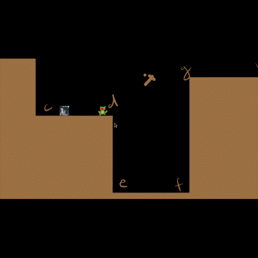

# Frog Game
A work in progress game about frogs that move around using their
tongues. The idea is that each player controls a frog and use it's
tongue to grab places and swing across the level. The game will be a
multiplayer and each player must try to arrive first at the end of the
level.

# What is done until now
- Base game engine
- Physics

